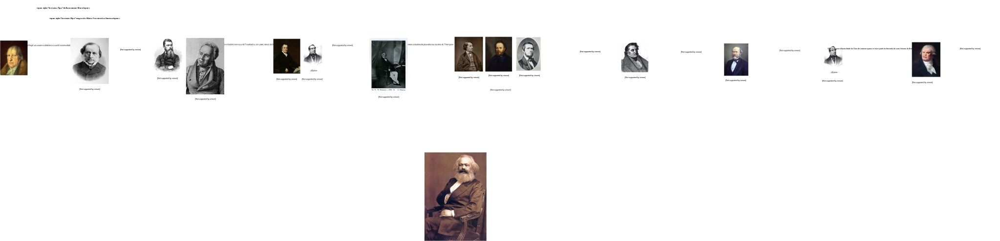

# Chapter 1

To understand Marxism, we cannot start with the presumption that Marx created every single point of its theory, and Marx himself helps us here.

> Now as for myself, I do not claim to have discovered either the existence of classes in modern society or the struggle between them. Long before me, bourgeois historians had described the historical development of this struggle between the classes, as had bourgeois economists their economic anatomy. My own contribution was 
> 1. to show that the existence of classes is merely bound up with certain historical phases in the development of production; 
> 2. that the class struggle necessarily leads to the dictatorship of the proletariat; 
> 3. that this dictatorship itself constitutes no more than a transition to the abolition of all classes and to a classless society.  
>
> Marx to Joseph Weydemeyer  
> London, 5 March 1852, 28 Dean Street, Soho
> http://web.archive.org/web/20020818204707/http://www.marxists.org/archive/marx/works/1852/letters/52_03_05.htm

With Marx giving here us the map, we can trace all the intellectuals influences of Marxism. But we also do not need to start this search from scracth. A movement as loved and hated as Marxism surely was scrutinized, and we do indeed have a lot of very good source for Marx's influences.

One such source comes from Brazilian philosopher, Mario Ferreira dos Santos.

So in the following chapters, we will go each of these influences, to understand their historical context, to then jump into Marx historical context, to then jump into Marx self-assessment of Marxism.

We will leave to the last part our own assessment of Mmarxism, which will  make this work more easily digestible even for Marxists. Ideally we will reach Aristotetle ideal of a real and fruitful discussion. Everyone will be able to agree with everything but the last chapter, where opinions will be divided.

The "Part 01" of this will work will follow the chronological order in which authors appeared. This will help to understand their historical context, given that all sources span throught England, Germany and France; and not everyone has the necessary knowledge os the history of these countries to understand why each of these authors wrote what they wrote.
